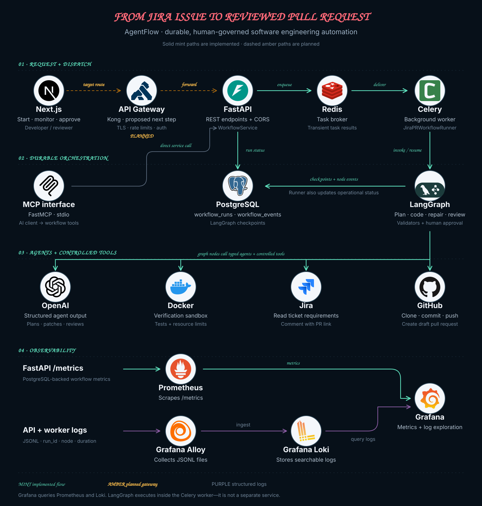
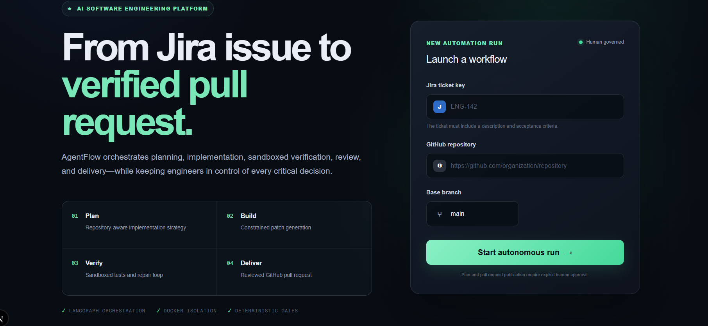

# AgentFlow

A Jira-to-GitHub draft PR workflow with LLM agents, durable execution and human approval.

AgentFlow reads a Jira ticket, builds repository context, proposes an implementation plan, generates a patch, runs verification and reviews the result. A reviewer approves the plan before implementation and approves publication before the workflow commits, pushes and creates a draft pull request.

The project combines a Next.js dashboard, a FastAPI application and Celery workers running LangGraph. It is a local development platform with production-oriented building blocks; authentication, an API gateway and multi-tenant deployment are still planned.

## System architecture

[](system_design/00-overall/diagram.svg)

*Click a diagram to view it at full size. Logos are embedded in the SVGs and do not require external image requests.*

The amber gateway path is the proposed next step: **Next.js → Kong → FastAPI**. Today the dashboard calls FastAPI directly. Kong is not yet configured in Docker Compose, and the diagram does not imply that authentication or rate limiting is active.

The main boundaries are:

- **HTTP control:** FastAPI validates requests and calls `WorkflowService`. Starting a workflow or submitting approval enqueues a task and returns `202 Accepted`.
- **Background execution:** Redis carries task messages. Celery calls `JiraPRWorkflowRunner`, which invokes or resumes LangGraph. LangGraph runs inside the worker process; it is not a separate server.
- **Durable state:** PostgreSQL stores the current run status, node events and LangGraph checkpoints. Redis task results are separate from this durable state.
- **Agent and tool execution:** agents produce structured plans, patches and reviews. Graph nodes call deterministic validators, Git/Jira/GitHub integrations and Docker verification.
- **MCP access:** a FastMCP stdio server exposes start, status and approval tools to an MCP-compatible client. These tools call the same `WorkflowService` directly.
- **Observability:** Prometheus scrapes the API's PostgreSQL-backed `/metrics` endpoint. Alloy ships JSONL logs to Loki. Grafana queries both data sources.

This is one backend codebase with separate API and worker processes, rather than a collection of independently deployed agent microservices.

### Detailed design diagrams

- [End-to-End Request Lifecycle](system_design/02-async-execution/diagram.svg) — asynchronous start, pause, approval, resume and publication.
- [LangGraph Workflow](system_design/03-langgraph-workflow/diagram.svg) — nodes, conditional routing, retry loops and terminal paths.
- [Durable Persistence](system_design/06-persistence/diagram.svg) — workflow records, events and LangGraph checkpoints.
- [System design guide](system_design/README.md) — diagram notes, sources and regeneration instructions.

## Run locally

### Prerequisites

- Python 3.10+
- Node.js and npm
- Git
- Docker Engine with Docker Compose
- A Jira Cloud account, a GitHub account and an OpenAI API key

### 1. Configure the environment

Create your private backend configuration from the committed template:

```bash
cp .env.example .env
code .env
```

Replace the placeholder values inside the repository-root `.env`:

```dotenv
# Jira Cloud
JIRA_BASE_URL=https://your-site.atlassian.net
JIRA_EMAIL=your-atlassian-account@example.com
JIRA_API_TOKEN=replace-with-an-atlassian-api-token
JIRA_CLOUD_ID=replace-with-your-cloud-id
JIRA_TICKET_KEY=SCRUM-1

# GitHub
GITHUB_TOKEN=github_pat_replace_with_your_token
BASE_URL=https://api.github.com

# OpenAI
OPENAI_API_KEY=replace-with-your-openai-api-key
OPENAI_MODEL=gpt-5
```

- Create the `JIRA_API_TOKEN` from [Atlassian API tokens](https://id.atlassian.com/manage-profile/security/api-tokens).
- Find `JIRA_CLOUD_ID` by opening `https://YOUR-SITE.atlassian.net/_edge/tenant_info` while logged in and copying `cloudId`.
- Create `GITHUB_TOKEN` from [GitHub fine-grained personal access tokens](https://github.com/settings/personal-access-tokens/new). Select the target repository and grant **Contents: Read and write** and **Pull requests: Read and write**.
- The token owner must be allowed to push branches and open pull requests in the repository entered in the dashboard.

The template also contains the local PostgreSQL, Redis, timeout and Grafana
settings. Jira, GitHub and OpenAI secrets belong only in the root `.env`, never
in frontend code. The real `.env` is ignored by Git.

Create the frontend configuration:

```bash
cp frontend/.env.local.example frontend/.env.local
```

It contains only:

```dotenv
NEXT_PUBLIC_API_BASE_URL=http://127.0.0.1:8000
```

### 2. Install the backend

```bash
python3 -m venv .venv
source .venv/bin/activate
python -m pip install --upgrade pip
python -m pip install -e ".[dev]" mcp prometheus-client
```

### 3. Start infrastructure and initialize PostgreSQL

```bash
docker compose up -d
alembic upgrade head
PYTHONPATH=src python scripts/setup_checkpoint_database.py
```

The initialization commands are required for first-time setup and after
relevant schema migrations. Docker Compose starts PostgreSQL, Redis, Adminer,
Prometheus, Loki, Alloy and Grafana.

### 4. Start the API

In terminal 1, from the repository root:

```bash
source .venv/bin/activate
uvicorn agentflow.api.main:app --host 0.0.0.0 --port 8000 --reload
```

### 5. Start the Celery worker

In terminal 2, from the repository root:

```bash
source .venv/bin/activate
celery -A agentflow.workers.celery_app:celery_app worker --loglevel=INFO
```

### 6. Start the dashboard

In terminal 3:

```bash
cd frontend
npm ci
npm run dev -- -p 3001
```

Open <http://localhost:3001>.

| Local page | Address |
| --- | --- |
| Dashboard | <http://localhost:3001> |
| API documentation | <http://localhost:8000/docs> |
| Grafana | <http://localhost:3000> |
| Prometheus | <http://localhost:9090> |
| Adminer | <http://localhost:8080> |

Grafana, Loki and Prometheus run as infrastructure services. Starting a
workflow does not start them. The verification worker also needs access to
Docker to build and run test containers.

## Dashboard

[](system_design/assets/screenshots/dashboard.png)

The dashboard starts workflow runs and presents the platform's four main stages: planning, constrained implementation, sandboxed verification and pull-request delivery. Detailed approval payloads and reviewed diffs are the next UI milestone.

## How a workflow runs

1. **Start:** the dashboard submits the ticket key, repository URL and base branch. The service creates a `PENDING` run, queues a Celery task and returns the `run_id`.
2. **Plan:** the worker runs the graph with `thread_id = run_id`. Nodes read the ticket, prepare the workspace and create and validate a plan.
3. **Pause:** `interrupt()` persists the graph's pause state through the checkpointer. The runner records `WAITING_FOR_APPROVAL` and the task returns. The worker remains available for other tasks.
4. **Approve and resume:** the dashboard polls the status endpoint and submits a decision. The service queues a new task; the runner calls `graph.invoke(Command(resume=...), config)` using the same `thread_id`.
5. **Implement and review:** the graph creates a branch, generates and validates a patch, applies it, runs Docker verification and performs code review. Repair routes are bounded. A second interrupt requests publication approval.
6. **Publish:** after final approval, the graph commits, pushes, creates a draft PR, comments on Jira and cleans up the workspace. The runner reports `COMPLETED` only when all three terminal conditions—PR created, Jira updated and workspace cleaned—are true.

`GET` reads the operational database; it does not execute or resume the graph. A Celery task returning successfully is also not sufficient to prove the workflow completed: its returned workflow status can be `FAILED`.

The sequence shows the approved path. Rejection terminates the workflow. At the plan gate, `request_changes` returns to planning; at the publication gate it currently ends execution rather than starting a repair cycle. Exceptions and incomplete terminal states are reported as failures.

## Persistence and inspection

| Data | Purpose |
| --- | --- |
| `workflow_runs` | Current status, current stage, task ID, timestamps and error information for a run |
| `workflow_events` | Node completion/failure records, durations and approval decisions |
| LangGraph checkpoint tables | Graph state and pending work required for resume |
| Redis broker / result backend | Task delivery and transient task results, not the source of truth for run status |

The same `run_id` connects the API response, operational records, graph thread and structured logs. A compatible worker can resume a checkpoint, but it must also have access to the run's repository workspace. PostgreSQL checkpoints alone do not move local files between hosts.

## API and MCP

| Method | Endpoint | Purpose |
| --- | --- | --- |
| `POST` | `/api/v1/workflows` | Start a run; return `202` |
| `GET` | `/api/v1/workflows/{run_id}` | Read status, stage and errors |
| `POST` | `/api/v1/workflows/{run_id}/approval` | Queue an approval decision; return `202` |
| `GET` | `/health` | API health response |
| `GET` | `/metrics` | Prometheus metrics |

The [MCP server](src/agentflow/mcp/server.py) exposes `start_workflow`, `get_workflow_status` and `submit_workflow_approval`. Its stdio transport is intended for a locally configured MCP client; it is separate from the planned HTTP gateway.

## Code tour

| Start here | What to inspect |
| --- | --- |
| [API routes](src/agentflow/api/routes/workflows.py) | HTTP contract |
| [WorkflowService](src/agentflow/services/workflow_service.py) | Persist, query and dispatch |
| [Celery tasks](src/agentflow/workers/tasks.py) | Worker entry points and lazy graph initialization |
| [Workflow runner](src/agentflow/workflows/jira_to_pr/runner.py) | Invoke, pause, resume and terminal status |
| [Graph](src/agentflow/workflows/jira_to_pr/graph.py) and [nodes](src/agentflow/workflows/jira_to_pr/nodes.py) | Agents, deterministic tools, routes and approval gates |
| [Checkpointer](src/agentflow/checkpointing/postgres.py) | PostgreSQL-backed graph persistence |
| [Observability configuration](infra/) | Prometheus, Alloy, Loki and Grafana |

## Current boundaries and next steps

- Add the planned Kong HTTP gateway and implement its policies.
- Expose the full approval payload and reviewed diff through the API and dashboard. The graph constructs these payloads, but the runner currently persists only the waiting status and approval-type event; it does not populate `workflow_runs.result_data` with them.
- Connect publication-stage `request_changes` to a repair route; it currently reaches `END` and does not meet the runner's completion conditions.
- Add authentication, authorization and tenant isolation before a public deployment.
- Define a workspace strategy before scaling workers across machines, and harden dispatch/resume idempotency.
- Add a repeatable agent evaluation suite; unit tests and sandbox verification do not measure overall agent quality by themselves.

See the [system design guide](system_design/README.md) for diagram sources, implementation references and regeneration instructions. Logo provenance and attribution are in [the asset notes](system_design/assets/logos/README.md).
