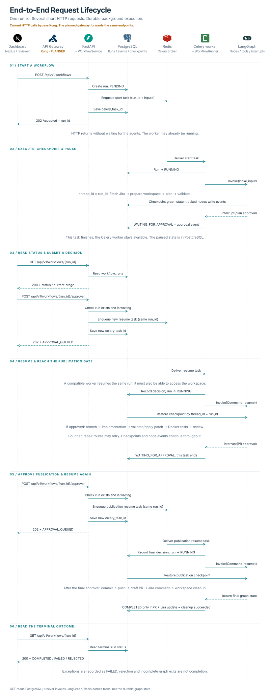

# End-to-End Request Lifecycle

This sequence consolidates HTTP dispatch, background execution, checkpointing, polling, both human approval gates and terminal status. It follows the current approved path and shows Kong as a planned, currently bypassed participant.

## Start and dispatch

`POST /api/v1/workflows` validates the request and calls `WorkflowService.start_workflow`. The service creates a `PENDING` database record, calls `celery_app.send_task`, saves the returned task ID and responds with `202 Accepted` and the `run_id`.

Dispatch is asynchronous: the worker can receive the message before the HTTP response reaches the browser. The request never waits for planning or implementation to finish.

## Worker execution and pause

The worker lazily obtains its runner and compiled graph. The runner marks the run `RUNNING` and invokes the graph with `configurable.thread_id = run_id`.

Tracked nodes update the current stage and write completion/failure events. The PostgreSQL checkpointer persists graph state separately. A completed node event means the function returned successfully; it does not prove that the following checkpoint or the whole workflow succeeded.

At `plan_approval_node`, `interrupt(approval_request)` suspends execution. The runner receives `__interrupt__`, updates the run to `WAITING_FOR_APPROVAL`, adds a waiting event and returns. The Celery task finishes and may store its transient result in Redis. No active task has to sit in the broker while the user decides; the durable pause is in PostgreSQL. The worker remains available.

## Poll and approve

`GET /api/v1/workflows/{run_id}` reads `workflow_runs` through the service. It does not call `graph.invoke`, load graph state or use the Celery result backend.

`POST /api/v1/workflows/{run_id}/approval` checks the run exists and is waiting, queues a new resume task with `run_id`, `decision` and `feedback`, saves its task ID and returns `APPROVAL_QUEUED` with HTTP `202`.

The resume runner records the decision and marks the run `RUNNING`. It calls `graph.invoke(Command(resume=...), config)` with the same thread ID. LangGraph loads the checkpoint and continues the interrupted path.

## Implementation and the second gate

After plan approval, the graph creates a branch, runs implementation, validates/applies the patch, verifies in Docker and reviews the result. Bounded repair routes handle selected failures. The graph then pauses at `human_pr_approval_node`.

Publication approval uses the same POST/dispatch/resume cycle with another task ID and the same run ID. After approval, graph nodes commit, push, create a draft PR, update Jira and clean the workspace.

## Terminal semantics

- `COMPLETED` requires `pull_request` to exist, `jira_updated` to be true and `workspace_cleaned` to be true.
- Human rejection produces `REJECTED`. Plan-stage `request_changes` returns to planning. Publication-stage `request_changes` currently goes to `END`, so it produces an incomplete failed outcome rather than a new repair cycle.
- Exceptions are persisted as failures. The runner labels checkpoint pool timeouts as `checkpoint_persistence` and adds a checkpoint failure event.
- Returning from the graph without satisfying completion conditions produces a failed terminal outcome. A successfully returned Celery task can therefore contain workflow status `FAILED`.

## Current limitations represented honestly

- Kong is planned. All current browser requests shown go directly to FastAPI.
- The API/service and worker/runner are grouped in the drawing because they share execution boundaries.
- The graph's approval payload includes the plan or patch/review information, but the runner currently records only the waiting status and approval-type event. The complete payload is not copied into `workflow_runs.result_data`, so GET should not be described as exposing a full diff/plan review yet.
- Resume on a different host needs a workspace strategy in addition to a shared database and broker.
- The service's database writes and broker dispatch are separate operations; the diagram does not claim transactional dispatch or exactly-once execution.

## Code references

- [HTTP routes](../../src/agentflow/api/routes/workflows.py)
- [WorkflowService](../../src/agentflow/services/workflow_service.py)
- [Celery tasks](../../src/agentflow/workers/tasks.py)
- [Runner](../../src/agentflow/workflows/jira_to_pr/runner.py)
- [Approval and tool nodes](../../src/agentflow/workflows/jira_to_pr/nodes.py)
- [Node tracking](../../src/agentflow/workflows/jira_to_pr/tracking.py)
- [PostgreSQL checkpointer](../../src/agentflow/checkpointing/postgres.py)

Edit the `participants` / `lifecycle` data in [the renderer](../render-diagrams.mjs), then run `node system_design/render-diagrams.mjs` from the repository root. The SVG and Mermaid export are generated from the same messages.
