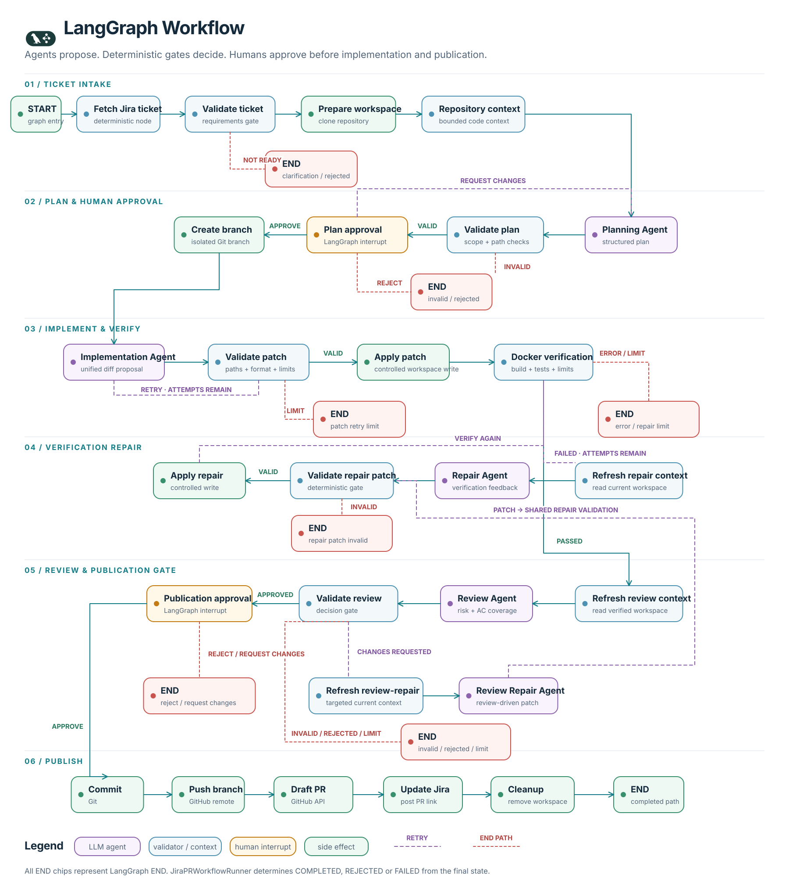

# LangGraph workflow

This diagram mirrors the nodes and conditional edges currently registered in `graph.py`. It uses the same white background, navy typography and teal primary flow as the overall and lifecycle diagrams.

## Visual language

- Purple nodes are LLM agents that return structured proposals or reviews.
- Blue nodes are deterministic validation or repository-context operations.
- Amber nodes are the two human approval interrupts.
- Green nodes perform controlled side effects such as Git operations, patch application and cleanup.
- Purple dashed edges are bounded retry or repair paths.
- Red dashed edges terminate at LangGraph `END` because validation failed, a limit was reached, or a reviewer rejected/requested changes at the publication gate.

Repeated red `END` chips represent the same LangGraph terminal concept and keep failure routes readable. LangGraph does not assign the external workflow status itself. After `graph.invoke` returns, `JiraPRWorkflowRunner` inspects the final state and records `COMPLETED`, `REJECTED` or `FAILED`.

## Exact routing represented

- Ticket clarification/rejection and invalid plans terminate.
- Plan `request_changes` returns to the Planning Agent.
- Invalid implementation patches retry while generation attempts remain; the retry limit terminates.
- Failed verification refreshes repository context before calling the Repair Agent. Verification errors and repair limits terminate.
- A valid repair patch is applied and verified again. An invalid repair patch terminates immediately in the current graph.
- Passed verification refreshes context before review.
- Review changes refresh targeted context, call the Review Repair Agent, then reuse repair validation/application/verification.
- Publication approval continues to commit only on `approve`. `reject` and `request_changes` currently terminate; `request_changes` therefore becomes `INCOMPLETE_WORKFLOW` in the runner.
- The successful publication path is commit → push → draft PR → Jira update → cleanup → `END`.

## Current design gaps

- Failure paths do not run workspace cleanup before reaching `END`.
- Transient model-provider errors such as timeouts and `429` responses do not have explicit graph retry routes.
- Publication-stage `request_changes` does not return to a repair node.
- End-to-end graph tests with fake agents would make the complete routing contract safer to change.

## Sources

- [Graph construction](../../src/agentflow/workflows/jira_to_pr/graph.py)
- [Node implementations](../../src/agentflow/workflows/jira_to_pr/nodes.py)
- [Conditional routes](../../src/agentflow/workflows/jira_to_pr/routes.py)
- [Graph state](../../src/agentflow/workflows/jira_to_pr/state.py)
- [Terminal status mapping](../../src/agentflow/workflows/jira_to_pr/runner.py)

Edit the workflow nodes and paths in [the diagram renderer](../render-diagrams.mjs), then run `node system_design/render-diagrams.mjs` from the repository root. It regenerates the designed SVG and Mermaid source together.
