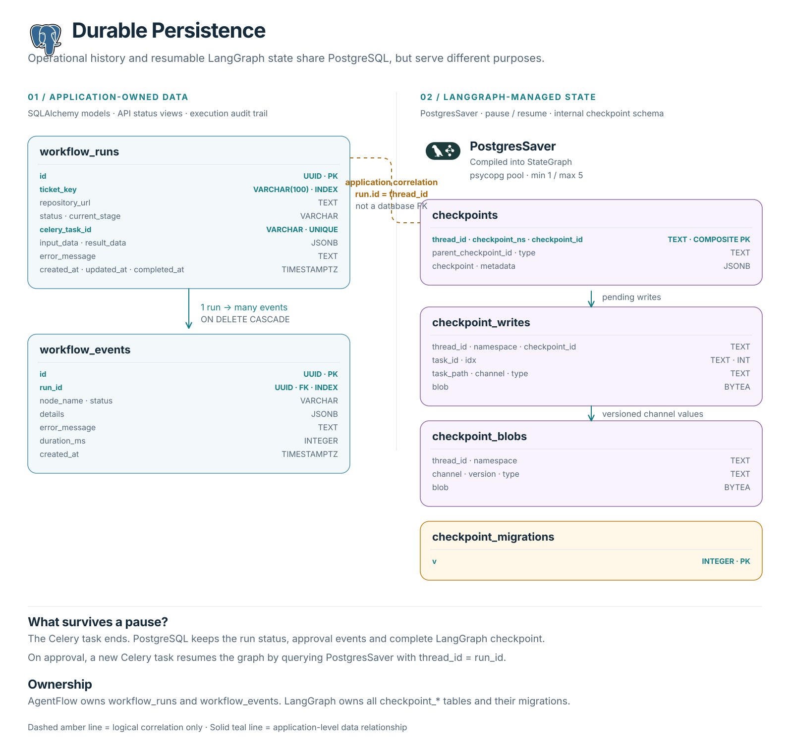

# Persistence

## Data ownership

- `workflow_runs`: current operational state queried by API/UI.
- `workflow_events`: append-only execution/audit history.
- LangGraph checkpoint tables: internal resumable state managed by `PostgresSaver`.

## Implementation mapping

- SQLAlchemy models and repository under `src/agentflow/database`.
- Alembic migration under `alembic/versions`.
- LangGraph-managed checkpoint schema initialized by `setup_checkpoint_database.py`.

## Review

Operational data and checkpoint data correctly serve different consumers even when stored in the same PostgreSQL database.

`workflow_runs.id` is reused as LangGraph's `thread_id` when invoking or
resuming a graph. This is an application-level correlation, not a database
foreign key. A paused Celery task can therefore finish while `PostgresSaver`
retains the durable graph state required by the next resume task.

The checkpoint tables and their composite keys are owned and migrated by
LangGraph. Application code should treat their schema as internal rather than
writing to them directly.

## Gaps

- Event pagination/query method, retention, archival, database indexes based on measured queries, transaction-level event/status consistency, and artifact records.
